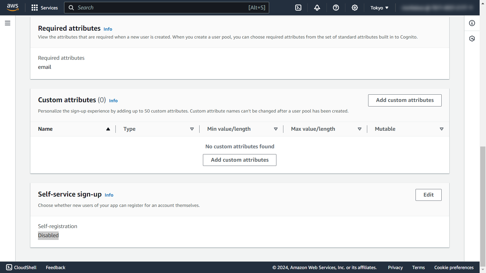

# Skeleton chat


## Deploy

* clone

```shell
git clone https://github.com/moritalous/skeleton-chat.git
```

* install

```shell
cd skeleton-chat/
npm install
```

* amplify init

```
amplify init
```

```
Note: It is recommended to run this command from the root of your app directory
? Enter a name for the environment dev
? Choose your default editor: Visual Studio Code
Using default provider  awscloudformation
? Select the authentication method you want to use: AWS profile

For more information on AWS Profiles, see:
https://docs.aws.amazon.com/cli/latest/userguide/cli-configure-profiles.html

? Please choose the profile you want to use default
Adding backend environment dev to AWS Amplify app: d24mpieq2vymyw

Deployment completed.
Deployed root stack skeletonchat [ ======================================== ] 4/4
        UnauthRole                     AWS::IAM::Role                 CREATE_COMPLETE                Sun Jan
        AuthRole                       AWS::IAM::Role                 CREATE_COMPLETE                Sun Jan
        DeploymentBucket               AWS::S3::Bucket                CREATE_COMPLETE                Sun Jan
        amplify-skeletonchat-dev-61132 AWS::CloudFormation::Stack     CREATE_COMPLETE                Sun Jan

Deployment state saved successfully.
⠦ Building resource api/skeletonchat⚠️ WARNING: owners may reassign ownership for the following model(s) and role(s): Chat: [owner]. If this is not intentional, you may want to apply field-level authorization rules to these fields. To read more: https://docs.amplify.aws/cli/graphql/authorization-rules/#per-user--owner-based-data-access.
✅ GraphQL schema compiled successfully.

Edit your schema at skeleton-chat/amplify/backend/api/skeletonchat/schema.graphql or place .graphql files in a directory at skeleton-chat/amplify/backend/api/skeletonchat/schema
✔ Initialized provider successfully.
✅ Initialized your environment successfully.
✅ Your project has been successfully initialized and connected to the cloud!
Some next steps:

"amplify status" will show you what you've added already and if it's locally configured or deployed
"amplify add <category>" will allow you to add features like user login or a backend API
"amplify push" will build all your local backend resources and provision it in the cloud
"amplify console" to open the Amplify Console and view your project status
"amplify publish" will build all your local backend and frontend resources (if you have hosting category added) and provision it in the cloud


Pro tip:
Try "amplify add api" to create a backend API and then "amplify push" to deploy everything
```

* amplify publish

```
amplify publish
```

Copy domain.

* Add signin and signout redirect URIs

Add domain.

```shell
amplify auth update
```

```
Please note that certain attributes may not be overwritten if you choose to use defaults settings.

You have configured resources that might depend on this Cognito resource.  Updating this Cognito resource could have unintended side effects.

Using service: Cognito, provided by: awscloudformation
 What do you want to do? Add/Edit signin and signout redirect URIs
 Which redirect signin URIs do you want to edit? 
 Do you want to add redirect signin URIs? Yes
 Enter your new redirect signin URI: https://dev.d24mpieq2vymyw.amplifyapp.com/
? Do you want to add another redirect signin URI No
 Which redirect signout URIs do you want to edit? 
 Do you want to add redirect signout URIs? Yes
 Enter your new redirect signout URI: https://dev.d24mpieq2vymyw.amplifyapp.com/
? Do you want to add another redirect signout URI No
✅ Successfully updated auth resource skeletonchatafe807ee locally

✅ Some next steps:
"amplify push" will build all your local backend resources and provision it in the cloud
"amplify publish" will build all your local backend and frontend resources (if you have hosting category added) and provision it in the cloud

✅ Successfully updated resource update locally

✅ Some next steps:
"amplify push" will build all your local backend resources and provision it in the cloud
"amplify publish" will build all your local backend and frontend resources (if you have hosting category added) and provision it in the cloud
```

Apply to cloud.

```
amplify publish
```


## Access app

1. Open URL and Click `ログイン`.
    

1. Create user from `Sign up` link.
    

1. Use chat😝
    


## Diable self sign up

1. Access [Cognito User pools console](https://ap-northeast-1.console.aws.amazon.com/cognito/v2/idp/user-pools).

1. Select created user pool

1. Select `Sign-up experience` tab, disable `Self-registration` in `Self-service sign-up` section.

    

## Add redirect setting

1. Access [Amplify console](https://ap-northeast-1.console.aws.amazon.com/amplify/home).

1. Select created app.

1. Select `Rewrites and redirects` menu.

1. Add redirect setting.

    | Source address | Target address | Type | 
    | --- | --- | --- |
    | </^[^.]+\$\|\.(?!(css\|gif\|ico\|jpg\|js\|png\|txt\|svg\|woff\|woff2\|ttf\|map\|json\|webp)\$)([^.]+$)/> | /index.html` | 200 |

    
